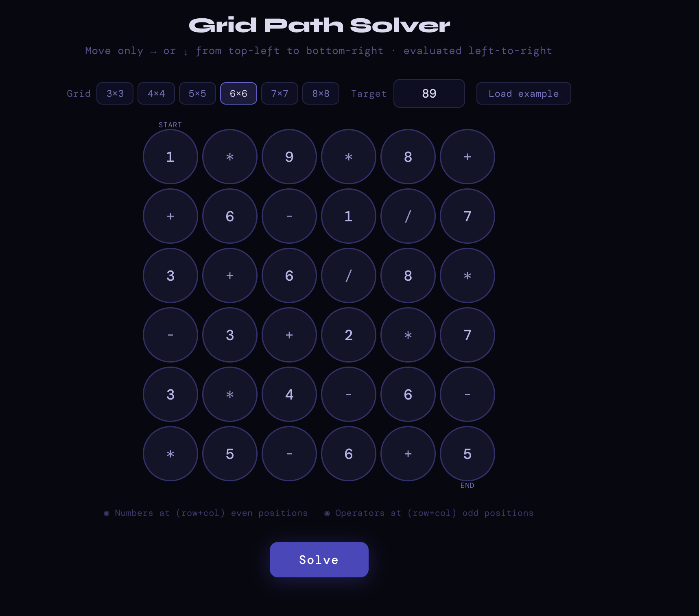
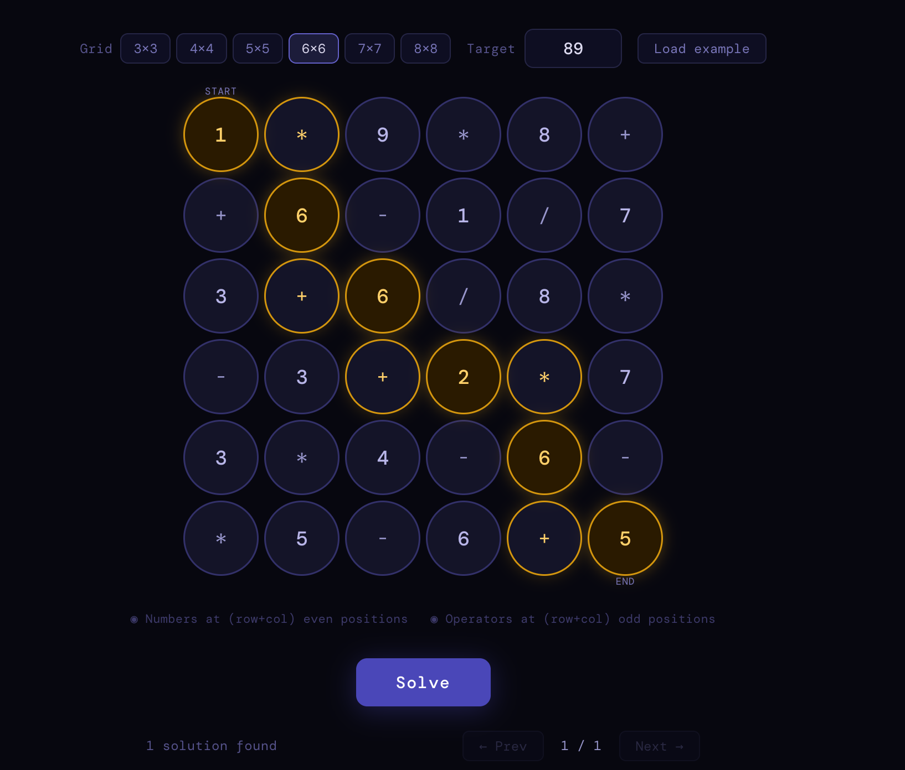
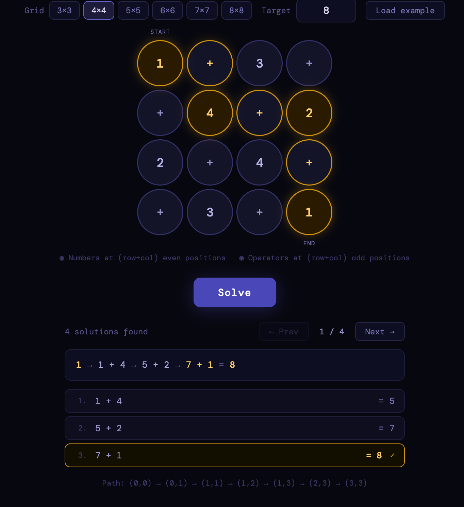
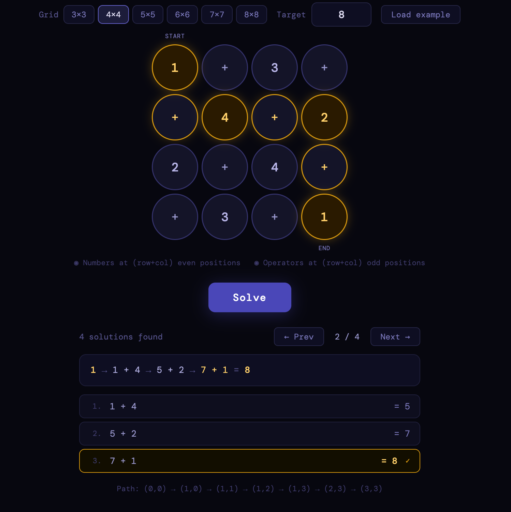
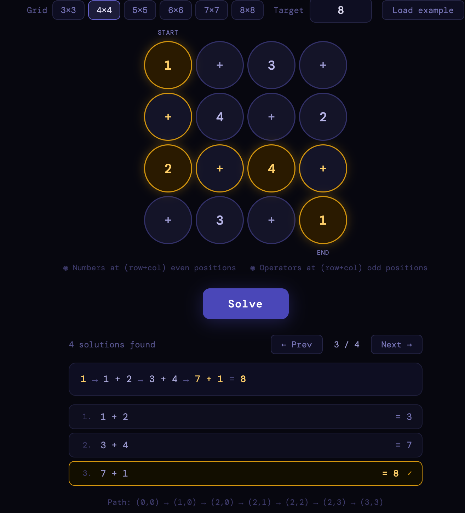
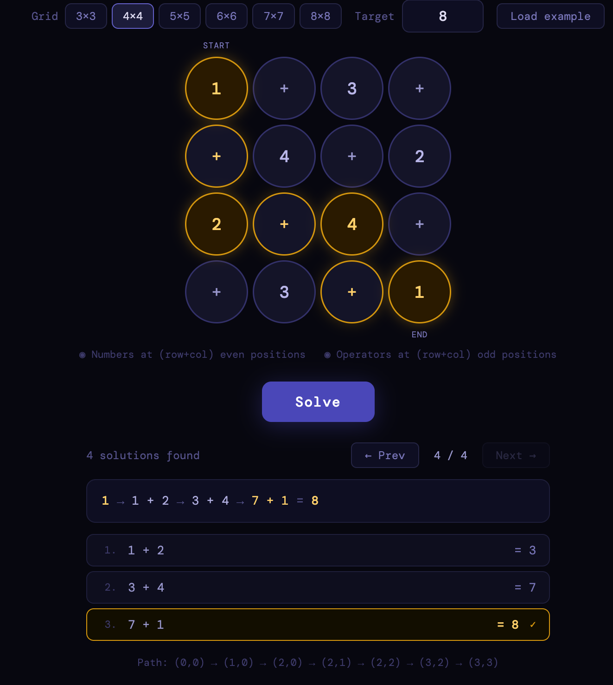

# 🎯 Grid Path Solver

A React-based puzzle solver that finds all valid paths through an arithmetic grid from top-left to bottom-right, evaluating each path's expression against a target value. Supports grids from 3×3 up to 8×8.

---

## 📸 Screenshots


**Main Interface**



**Solution Found**



**Multiple Solutions Navigator**








---

## ✨ Features

- **Variable grid size** — supports 3×3 through 8×8 grids
- **Editable cells** — click any number cell to change its value; operator cells have a dropdown (＋ − × ÷)
- **Custom target** — set any integer as the goal value
- **Finds all solutions** — doesn't stop at the first hit; every valid path is collected
- **Solution navigator** — if multiple paths reach the target, step through them with Prev / Next
- **Step-by-step breakdown** — each solution shows the full arithmetic trace with running totals
- **Path coordinates** — displays the exact (row, col) sequence of the winning path
- **Example puzzle loader** — pre-fills the 6×6 puzzle from the original image (target = 89)
- **Float safety** — uses epsilon comparison so division results like `1/3 + 2/3 = 1.000…` still match

---

##  How the Grid Works

Cells follow a strict **checkerboard parity rule**:

| Position | Condition | Cell type |
|---|---|---|
| Top-left, and any cell where `(row + col)` is **even** | number | editable integer |
| Any cell where `(row + col)` is **odd** | operator | `+` `−` `×` `/` |

This means the path always reads as a valid arithmetic expression:

```
number → op → number → op → number → ...
```

Movement is **right or down only**, from `(0, 0)` to `(N−1, N−1)`.

The expression is evaluated **left-to-right** with no operator precedence — each operator applies to the current running total and the next number.

---

##  How the Algorithm Works

The solver uses **depth-first search (DFS)** with implicit backtracking.

### Core idea

```
dfs(row, col, runningValue, pendingOp, pathSoFar)
```

At each cell, the function:

1. **Base case** — if we've reached `(N−1, N−1)`, check `|runningValue − target| < 0.0001`. If it matches, save a snapshot of the path.
2. **Operator cell** — store the operator as `pendingOp` and recurse without changing the value.
3. **Number cell** — apply `pendingOp` to get a new running value, then recurse.
4. **Two branches** — try moving right first, then down. Both branches are always explored so all solutions are found.

### Why DFS fits perfectly

- All state (`value`, `pendingOp`, `path`) lives in local variables on the call stack.
- Backtracking is **free** — when a frame returns, its locals are discarded automatically. No undo step.
- The `path` array uses `[...path, [row, col]]` (spread copy) per call, so each branch owns its own snapshot.

### Complexity

| Dimension | Value |
|---|---|
| Time | O(2^(2N−2)) — at most 2 choices per step, path length 2N−2 |
| Stack space | O(N) — recursion depth equals path length |
| Solution storage | O(N · S) — S snapshots of length 2N−1 each |

For a 6×6 grid this is at most ~1,024 paths, which completes in < 1 ms.

### Example trace (3×3, target = 5)

```
Grid:
  1  +  2
  ×  3  −
  4  +  1

Path 1: (0,0)→(0,1)→(1,1)→(2,1)→(2,2)
  1 + 3 + 1 = 5  ✓
```

---

##  Getting Started

### Prerequisites

- [Node.js](https://nodejs.org/) v18 or later
- npm (bundled with Node)

### Installation

```bash
# Clone the repository
git clone https://github.com/your-username/grid-path-solver.git
cd grid-path-solver

# Install dependencies
npm install
```

### Running locally

```bash
npm run dev
```

Open [http://localhost:5173](http://localhost:5173) in your browser.

### Build for production

```bash
npm run build
```

The output goes to the `dist/` folder.

---

## 🗂️ Project Structure

```
grid-path-solver/
├── src/
│   └── assets
│   └── GridSolver.jsx     # Main component — grid 
editor, solver, results
│   └── App.jsx
│   └── main.jsx
├── public/
├── screenshots/           # Add your screenshots here
├── index.html
├── package.json
└── README.md
```

---

##  Tech Stack

| Tool | Purpose |
|---|---|
| React 18 | UI and state management |
| Vite | Dev server and bundler |
| Vanilla CSS | Styling (no CSS framework) |

---

##  Usage Guide

### Loading the example puzzle

Click **Load example** to populate a 6×6 grid with the original puzzle (target = 89). Hit **Solve** to find the solution.

### Building your own puzzle

1. Use the **grid size buttons** (3–8) to pick a grid dimension.
2. Click any **number cell** and type a new value.
3. Click any **operator cell** and select `+`, `−`, `×`, or `/` from the dropdown.
4. Set the **Target** field to your desired result.
5. Click **Solve**.

### Reading the results

- **Highlighted cells** — the amber path on the grid shows which cells are visited.
- **Expression** — a single line shows the full equation, e.g. `1 × 6 + 6 + 2 × 6 + 5 = 89`.
- **Step breakdown** — each arithmetic step is listed with its running total.
- **Multiple solutions** — use **← Prev** / **Next →** to cycle through every valid path.

---

##  Grid Rules (Quick Reference)

- Start cell `(0,0)` is always a **number**.
- End cell `(N−1, N−1)` is always a **number** (since both row and column indices are even for any N).
- You may only move **right** or **down** — no diagonal, no backtracking on the grid itself.
- Division by zero paths are automatically skipped (`isFinite` check).

---

## 🤝 Contributing

Pull requests are welcome. For major changes, open an issue first to discuss what you'd like to change.

```bash
# Fork → clone → create branch → commit → push → open PR
git checkout -b feature/my-improvement
git commit -m "add: my improvement"
git push origin feature/my-improvement
```
